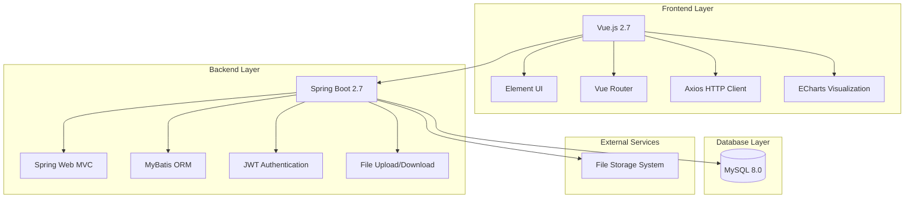
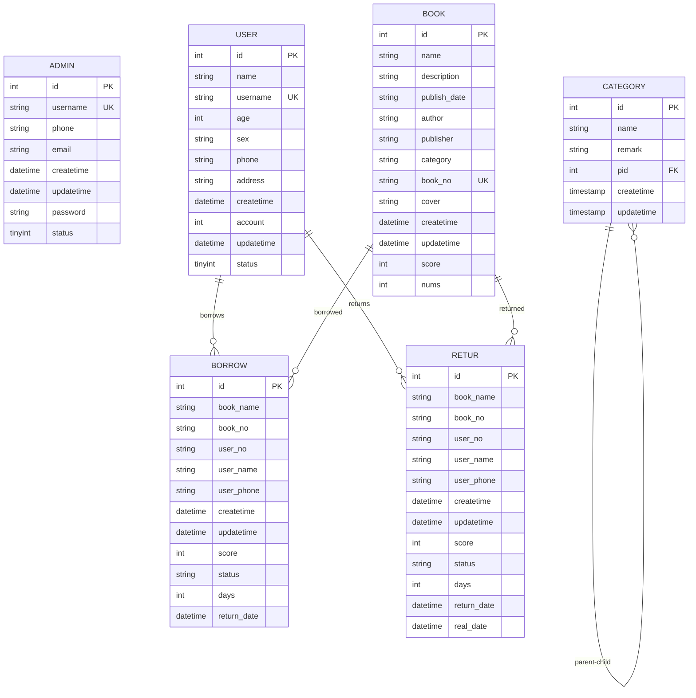

<h2 align="center">
  Management Dashboard <br/>
</h2>


<p align="center">
  
  
  
  
  
  
</p>
<p align="center">
  A comprehensive full-stack management system built with Spring Boot and Vue.js, designed for efficient book lending and return operations with administrative capabilities.
</p>


## Table of Contents

- [Overview](#overview)
- [System Architecture](#system-architecture)
- [Features](#features)
- [Technology Stack](#technology-stack)
- [Database Schema](#database-schema)
- [Project Structure](#project-structure)
- [Installation](#installation)
- [Configuration](#configuration)
- [API Documentation](#api-documentation)
- [Usage](#usage)
- [Screenshots](#screenshots)
- [Contributing](#contributing)
- [License](#license)

## Overview

The Management Dashboard is a modern web application that streamlines library operations including book inventory management, user registration, borrowing and returning processes, and administrative oversight. The system features role-based access control, real-time statistics, and an intuitive user interface.

## System Architecture



## Features

### Core Functionality
- **User Management**: Registration, profile management, and account status control
- **Book Management**: CRUD operations for book inventory with cover image support
- **Category Management**: Hierarchical book categorization system
- **Borrowing System**: Book lending with due date tracking and status management
- **Return System**: Book return processing with overdue detection
- **Administrative Dashboard**: Real-time statistics and system oversight

### Advanced Features
- **JWT Authentication**: Secure token-based authentication system
- **File Management**: Book cover upload and download with secure access
- **Data Visualization**: Interactive charts for borrowing and return statistics
- **Responsive Design**: Mobile-friendly interface with collapsible navigation
- **Search and Pagination**: Efficient data browsing with filtering capabilities
- **Role-based Access**: Separate admin and user access levels

## Technology Stack

### Backend
| Technology | Version | Purpose |
|------------|---------|---------|
| Java | 1.8 | Core programming language |
| Spring Boot | 2.7.3 | Application framework |
| MyBatis | 2.2.2 | ORM framework |
| MySQL Connector | Runtime | Database connectivity |
| JWT | 3.10.3 | Authentication |
| Hutool | 5.8.0 | Utility library |
| PageHelper | 1.4.5 | Pagination support |
| Lombok | Latest | Code generation |

### Frontend
| Technology | Version | Purpose |
|------------|---------|---------|
| Vue.js | 2.7.14 | Frontend framework |
| Element UI | 2.15.12 | UI component library |
| Vue Router | 3.5.1 | Client-side routing |
| Axios | 0.27.2 | HTTP client |
| ECharts | 5.4.1 | Data visualization |
| js-cookie | 3.0.1 | Cookie management |

### Database
- **MySQL 8.0**: Primary database for data persistence

## Database Schema



## Project Structure

```
Management_Web_System/
├── backend/
│   └── springboot/
│       ├── src/main/java/com/example/zyt/
│       │   ├── common/          # Common utilities and configurations
│       │   ├── controller/      # REST API controllers
│       │   ├── exception/       # Exception handling
│       │   ├── mapper/          # MyBatis mappers
│       │   ├── model/           # Entity models
│       │   ├── service/         # Business logic services
│       │   └── utils/           # Utility classes
│       ├── src/main/resources/
│       │   ├── mapper/          # MyBatis XML mappings
│       │   └── application.yml  # Application configuration
│       ├── files/               # File upload storage
│       └── pom.xml             # Maven dependencies
├── frontend/
│   └── vue-v2/
│       ├── src/
│       │   ├── assets/          # Static assets
│       │   ├── router/          # Vue Router configuration
│       │   ├── utils/           # Frontend utilities
│       │   └── views/           # Vue components and pages
│       ├── public/              # Public static files
│       └── package.json         # NPM dependencies
├── sql/
│   └── library-management.sql   # Database schema and sample data
└── README.md
```

## Installation

### Prerequisites
- Java 8 or higher
- Node.js 14+ and npm
- MySQL 8.0+
- Maven 3.6+

### Backend Setup

1. **Clone the repository**
   ```bash
   git clone <repository-url>
   cd Management_Web_System
   ```

2. **Database Setup**
   ```bash
   # Create database
   mysql -u root -p
   CREATE DATABASE library_management;
   
   # Import schema and data
   mysql -u root -p library_management < sql/library-management.sql
   ```

3. **Configure Database Connection**
   ```yaml
   # backend/springboot/src/main/resources/application.yml
   spring:
     datasource:
       url: jdbc:mysql://localhost:3306/library_management?serverTimezone=GMT%2b8
       username: root
       password: your_password
   ```

4. **Build and Run Backend**
   ```bash
   cd backend/springboot
   mvn clean install
   mvn spring-boot:run
   ```
   Backend will start on `http://localhost:9090`

### Frontend Setup

1. **Install Dependencies**
   ```bash
   cd frontend/vue-v2
   npm install
   ```

2. **Configure API Base URL**
   ```javascript
   // frontend/vue-v2/src/utils/request.js
   const request = axios.create({
     baseURL: 'http://localhost:9090/api'
   })
   ```

3. **Run Development Server**
   ```bash
   npm run serve
   ```
   Frontend will start on `http://localhost:8080`

4. **Build for Production**
   ```bash
   npm run build
   ```

## Configuration

### Backend Configuration

The main configuration file is located at `backend/springboot/src/main/resources/application.yml`:

```yaml
server:
  port: 9090

spring:
  datasource:
    driver-class-name: com.mysql.cj.jdbc.Driver
    url: jdbc:mysql://localhost:3306/library_management?serverTimezone=GMT%2b8
    username: root
    password: your_password

mybatis:
  mapper-locations: classpath:mapper/*.xml
  configuration:
    log-impl: org.apache.ibatis.logging.stdout.StdOutImpl
    map-underscore-to-camel-case: true
```

### Frontend Configuration

Vue CLI configuration in `frontend/vue-v2/vue.config.js`:

```javascript
module.exports = {
  devServer: {
    proxy: {
      '/api': {
        target: 'http://localhost:9090',
        changeOrigin: true
      }
    }
  }
}
```

## API Documentation

### Authentication Endpoints

| Method | Endpoint | Description |
|--------|----------|-------------|
| POST | `/api/admin/login` | Admin login |
| POST | `/api/admin/register` | Admin registration |

### User Management

| Method | Endpoint | Description |
|--------|----------|-------------|
| GET | `/api/user/list` | Get all users |
| GET | `/api/user/page` | Get paginated users |
| POST | `/api/user/save` | Create new user |
| PUT | `/api/user/update` | Update user |
| DELETE | `/api/user/delete/{id}` | Delete user |
| POST | `/api/user/account` | Update user account |

### Book Management

| Method | Endpoint | Description |
|--------|----------|-------------|
| GET | `/api/book/list` | Get all books |
| GET | `/api/book/page` | Get paginated books |
| POST | `/api/book/save` | Create new book |
| PUT | `/api/book/update` | Update book |
| DELETE | `/api/book/delete/{id}` | Delete book |
| POST | `/api/book/file/upload` | Upload book cover |
| GET | `/api/book/file/download/{flag}` | Download book cover |

### Borrowing Operations

| Method | Endpoint | Description |
|--------|----------|-------------|
| GET | `/api/borrow/list` | Get all borrowing records |
| GET | `/api/borrow/page` | Get paginated borrowing records |
| POST | `/api/borrow/save` | Create borrowing record |
| PUT | `/api/borrow/update` | Update borrowing record |
| DELETE | `/api/borrow/delete/{id}` | Delete borrowing record |
| GET | `/api/borrow/lineCharts/{timeRange}` | Get borrowing statistics |

### Category Management

| Method | Endpoint | Description |
|--------|----------|-------------|
| GET | `/api/category/list` | Get all categories |
| GET | `/api/category/page` | Get paginated categories |
| POST | `/api/category/save` | Create new category |
| PUT | `/api/category/update` | Update category |
| DELETE | `/api/category/delete/{id}` | Delete category |

## Usage

### Default Login Credentials

**Administrator Access:**
- Username: `admin`
- Password: `admin123`

### Basic Workflow

1. **Admin Login**: Access the admin dashboard at `http://localhost:8080/login`
2. **User Management**: Register library members and manage their accounts
3. **Book Management**: Add books to the inventory with categories and cover images
4. **Borrowing Process**: Process book loans with due date tracking
5. **Return Process**: Handle book returns and update inventory
6. **Statistics**: View borrowing and return trends on the dashboard

### Features Usage

**Dashboard Statistics:**
- View real-time borrowing and return statistics
- Filter data by time ranges (week, month, 2-3 months)
- Interactive charts powered by ECharts

**File Management:**
- Upload book covers through the book management interface
- Secure file access with JWT token validation
- Automatic file naming with timestamp prefixes

**Search and Filter:**
- Use pagination controls for large datasets
- Filter books by category, author, or title
- Search users by name or membership ID

## License

This project is licensed under the MIT License - see the [LICENSE](LICENSE) file for details.
